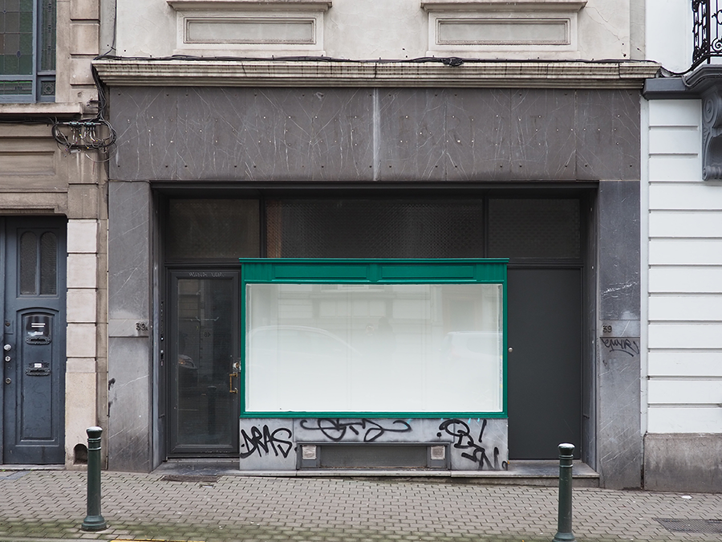

  

# Alice  Mendelowitz

27/2/21—27/3/21  

pegs is pleased to host a series of new paintings by Alice Mendelowitz. These works are painted onto reusable, washable nappy liners. They show scenes painted from photographs of the artists’ personal and domestic life, her partner, their daughter, their friends and the city they live in.

To coincide with the opening at pegs, documentation of the show will be added to the website.  

[alice-website](https://alicemendelowitz.tumblr.com/)
